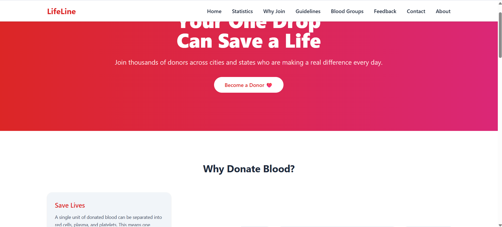
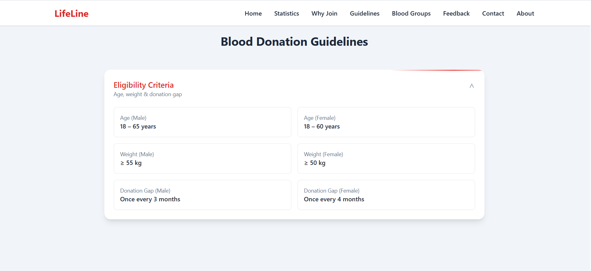
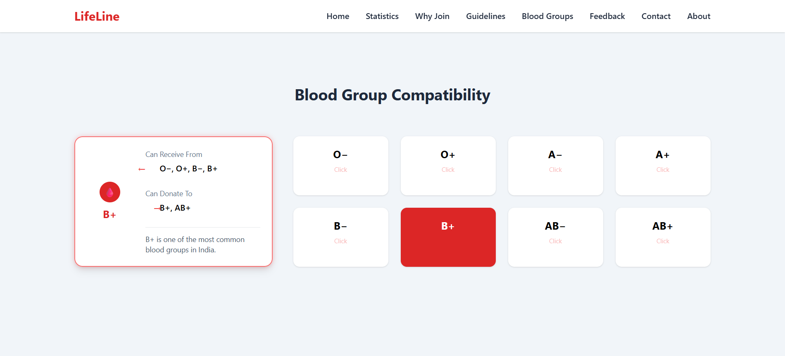
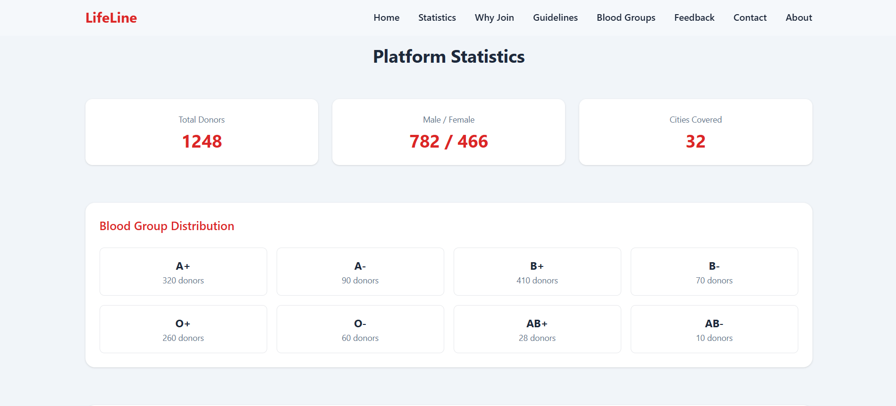

# 🩸 Lifeline — Blood Donor Management System

Lifeline is a web-based Blood Donor Management System designed to help people quickly find blood donors during medical emergencies.

The platform aims to connect **blood donors and patients** through an easy-to-use digital system.

This project is being developed as both a **real-world social utility platform** and a **full-stack development project**.

---

# 🌐 Project Status

Current development stage:

* ✅ Public Landing Page (Completed)
* 🚧 User Authentication System (In Development)
* 🚧 Donor Registration System (In Development)
* 🚧 Admin Dashboard (In Development)
* 🚧 Blood Request Management (Planned)

The system is actively being developed and new features will be added gradually.

---

# 🚀 Features

## 🌍 Public Landing Page

The landing page is publicly accessible and introduces the purpose of the platform.

It includes:

* project introduction
* system purpose
* call-to-action for donor participation
* navigation for future login and registration features

The landing page is designed to spread awareness about blood donation and encourage people to participate.

---

# 📷 Landing Page Preview

Below is the current public landing page of the platform.






---

# 🔐 User System (Upcoming)

Registered users will be able to:

* register as blood donors
* update availability status
* search for donors by blood group
* submit blood requests
* manage their donor profile

---

# 🧑‍💼 Admin System (Upcoming)

Admin will have full control over the platform.

Admin features will include:

* donor management
* user management
* blood request monitoring
* approval systems
* platform analytics

---

# 🔍 Donor Search System

Users will be able to filter donors based on:

* blood group
* location
* availability status

This will help patients quickly find suitable donors.

---

# 🧑‍💻 Tech Stack

Frontend

* HTML
* CSS
* JavaScript
* React (client)

Backend

* Node.js
* Express.js

Database

* MongoDB

---

# 📂 Project Structure

```
lifeline-blood-donor-system
│
├ client
│   ├ public
│   │   └ snaps
│   │       └ landing-page.png
│   │
│   └ src
│
├ server
│
├ LICENSE
└ README.md
```

---

# 🎯 Purpose of the Project

The main goal of Lifeline is to create a platform where people can quickly find blood donors during emergencies.

The system also serves as a **learning project focused on building a scalable full-stack application**.

---

# 🔄 Future Development

Planned improvements include:

* full user authentication system
* donor availability tracking
* admin management dashboard
* emergency blood request system
* notification system for donors
* improved UI and accessibility

---

# 👨‍💻 Developer

Pawan Kumar Sharma
Full Stack Developer

🌐 Website
https://www.askdevpk.me

💻 GitHub
https://github.com/itspksharma

---


## 📄 License

This project is licensed under the MIT License.

You are free to use, modify, and distribute this software with proper attribution.

See the LICENSE file for more information.